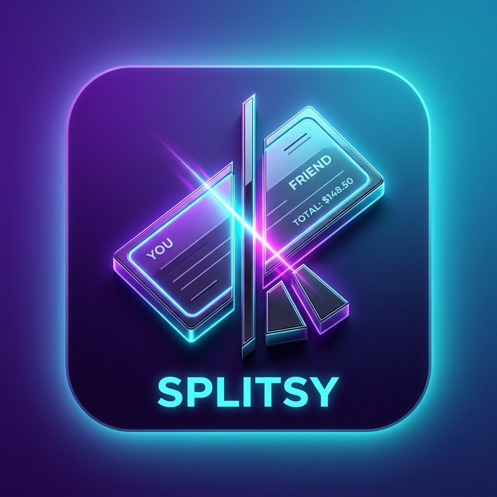

<p align="center">
  
</p>

<h1 align="center">Splitsy</h1>

<p align="center">
  <strong>An Open-Source, Decoupled, Mobile-First PWA Splitwise Clone.</strong><br>
  Split expenses with flatmates and friends—no App Store fees, zero Mac required for development, and completely self-hostable.
</p>

<p align="center">
  
  
  
  
  
  
</p>

---

## ✨ Features

* 📱 **Mobile-First & Installable**: A Progressive Web App (PWA) that installs directly from Safari (iOS) or Chrome (Android) onto home screens, bypassing the App Store.
* 🔌 **Decoupled Backend Architecture**: Swappable adapters let you run the app in:
  1. **Local-Only Mode** (Default/Offline): Stores data locally on device (IndexedDB) with zero cloud setup.
  2. **Firebase Mode**: Syncs groups and bills in real-time using Firebase Auth & Cloud Firestore.
  3. **Supabase Mode** (Future-ready): Relational database structures for self-hosting.
* 📶 **Offline-First & Auto-Sync**: Log expenses basement supermarkets or deep tunnels; changes cache locally and sync to the cloud database when signal returns.
* 🧮 **Greedy Debt Simplification**: Built-in split balance matching algorithm simplifies group balances to minimize payments.
* 🎨 **Premium Aesthetics**: Rich dark mode dashboard and light mode settings panel that automatically matches system OS themes.
* 📈 **CSS Spending Analytics**: Interactive category percentages and budget metrics generated using lightweight, performant CSS progress bars (no heavy external chart libraries).

---

## 🛠️ Quick Start (Run Locally)

### Prerequisites
Make sure you have Node.js (LTS recommended) and npm installed.

### Setup
1. **Clone the repository**:
   ```bash
   git clone https://github.com/fizcool-debug/Splitsy.git
   cd Splitsy
   ```

2. **Install dependencies**:
   ```bash
   npm install
   ```

3. **Start local development server**:
   ```bash
   npm run dev
   ```
   Open `http://localhost:5173` in your browser. By default, the app runs in **Local-Only** mode. You can log in using **Guest Mode** (no email or password required) to immediately start using it locally!

4. **Build for production (PWA files)**:
   ```bash
   npm run build
   ```
   This generates the static code distribution along with the service worker (`sw.js`) inside the `dist/` directory.

---

## ☁️ Connecting Firebase (Cloud Sync Setup)

To enable multi-device sync for your flatmates:

1. Create a project on the **[Firebase Console](https://console.firebase.google.com/)**.
2. Enable **Email/Password** authentication in **Build -> Authentication**.
3. Create a **Firestore Database** in **Build -> Firestore Database** (start in Test or Production mode).
4. Register a **Web App** in your Firebase project dashboard and copy the credentials configuration.
5. Create a `.env` file in the root of the project:
   ```env
   # Set provider to 'firebase'
   VITE_BACKEND_PROVIDER=firebase

   # Insert your Firebase Web App credentials
   VITE_FIREBASE_API_KEY=your_api_key
   VITE_FIREBASE_AUTH_DOMAIN=your_auth_domain
   VITE_FIREBASE_PROJECT_ID=your_project_id
   VITE_FIREBASE_STORAGE_BUCKET=your_storage_bucket
   VITE_FIREBASE_MESSAGING_SENDER_ID=your_messaging_sender_id
   VITE_FIREBASE_APP_ID=your_app_id
   ```
6. Run `npm run dev` or build/deploy. Splitsy will now securely synchronize all shared bills to the cloud.

---

## 📁 Project Structure

```
splitsy/
├── public/                 # PWA icons, manifest, and favicon resources
├── src/
│   ├── components/         # Shared UI parts (Navigation bars, Modal sheets)
│   ├── context/            # React global AppContext state hooks
│   ├── pages/              # Primary views (Dashboard, GroupDetails, Analytics, Settings)
│   ├── services/           # Backend adapters (Local storage, Firebase config & triggers)
│   │   ├── auth/           # Auth interfaces and implementations
│   │   └── db/             # Database interfaces and implementations
│   ├── utils/              # Balance calculators and debt-minimizer engines
│   ├── App.tsx             # Main view selector
│   └── main.tsx            # App mount, PWA Service Worker hook
├── vite.config.ts          # Vite build config and PWA configurations
└── index.html              # Viewport configurations & iOS safari capabilities
```

---

## 📄 License
This project is licensed under the MIT License - see the [LICENSE](LICENSE) file for details.
